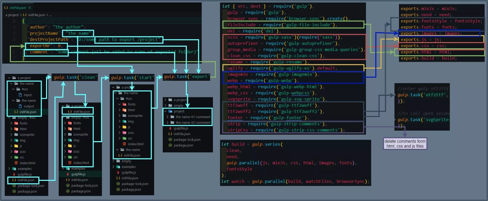

# Gulp config

## Description

My gulp configuration for web development projects. Processing source files like: style (css/scss), html, js, font (ttf,otf), images (jpg, jpeg, png, gif) and svg to generate new files (woff, woff2, webp and svg sprite). Automatically add load fonts in css file (@font-face), create minified versions and remove comments in production folder.

## Examples 👁️

<h2 align="center">


---

## Technologies used 🛠️

<h3 align="left"> &nbsp  &nbsp  &nbsp Programming languages</h3>

<a href="https://developer.mozilla.org/en-US/docs/Web/JavaScript" target="_blank">  </a>

<h3 align="left"> &nbsp  &nbsp  &nbsp Engines</h3>
<a href="https://nodejs.org" target="_blank">  </a>

<h3 align="left"> &nbsp  &nbsp  &nbsp Module bundlers</h3>
<a href="https://gulpjs.com/" target="_blank">  </a>

<h3 align="left"> &nbsp  &nbsp  &nbsp Package Managers</h3>
<a href="https://www.npmjs.com/" target="_blank">  </a>

---

## Features 💡

⚡️ Importing an empty project template\
⚡️ Export project to specified path\
⚡️ Watching files\
⚡️ Automatically create minified version of css and s files
⚡️ Transform scss to css\
⚡️ Group css media queries\
⚡️ Automatically compress images create webp files\
⚡️ Automatically add fonts all fonts files in css\
⚡️ Automatically webp files in picture tag for html and in css background property(using classes)\
⚡️ Remove comments in production files\

## How To Use 🔧

clone git repository or download zip,\
then open terminal in project folder (where is `package.json` file)\
and install all dependencies:

```bash
# Install dependencies
$ npm install

# Clean the project folder and import initFile.json
$ gulp clean
# or copy manually initFile.json in ./a project/

# enter project name in ./a project/initFile.json then run
$ gulp start
# - Copy an empty project template and generate project folder structure

# Start gulp (build, watch and browserSync) by running
$ gulp

# To generate svg sprite use
$ gulp svgSprite

# To transform .ttf font files in .otf (in source files) use
$ gulp otf2ttf

# You can export your project by adding / editing destination path and comment in initFile.json and run
$ gulp export

# You can run any particular gulp task (like: css, html, images ...) by running
$ gulp <task>
```

---

## Acknowledgments 🎁

Thanks to
[Евгений Андриканич](https://fls.guru/) ,
[Vladilen Minin](https://www.youtube.com/c/VladilenMinin) ,
[CS50](https://cs50.harvard.edu/college/2021/fall/) ,
[Александр Лущенко](https://itgid.info/) ,
[Vadim Makeev](https://www.youtube.com/channel/UCaTfYudJUVA8cV_But8KZVQ) ,
[Safak](https://github.com/safak) ,
[Adrian Hajdin](https://www.completepathtojavascriptmastery.com/) ,
[Sumit Dey](https://www.youtube.com/c/BackbenchCoder)
for motivational and helpful content

---
